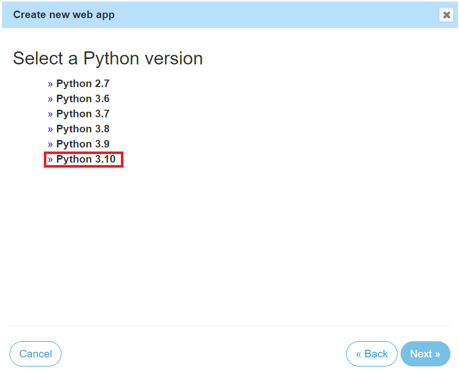

# 尚虎雲平台-銷售端文件

## 簡介
這是一個用於銷售商品的平台。

## 下載檔案

1. 請先將檔案下載下來 [載點](https://github.com/shanghuyun/Shanghuyun-Sales-side/releases/tag/%E6%AA%94%E6%A1%88)

## 部署到 PythonAnywhere

### 1. 註冊 PythonAnywhere 帳戶

請先至 [PythonAnywhere](https://www.pythonanywhere.com/registration/register/beginner/) 註冊一個帳戶。

↓↓↓註冊完成畫面應該如下圖↓↓↓


### 2. 上傳檔案

- 點擊 **"Files"** 底下的 **Browse files**

  

- 將剛剛下載的檔案上傳

  

### 3. 新增 Bash

返回一開始畫面新增一個 **Bash**


### 4. 安裝虛擬機

輸入以下指令

```bash
mkvirtualenv myvirtualenv --python=/usr/bin/python3.10 && unzip Sales-side.zip && cd Sales-side && pip install -r requirements.txt
```


### 5. 新增 Web 應用程序

點擊 **Open Web tab** 新增一個 App





### 6. 配置 WSGI

進入 WSGI 設置


將程式碼改成以下程式碼，記得要替換成自己的帳號名稱，並按下保存

```python
# +++++++++++ DJANGO +++++++++++
# To use your own django app use code like this:
import os
import sys

# assuming your django settings file is at '/home/myusername/mysite/mysite/settings.py'
path = '/home/替換成自己的帳號名稱/Sales-side'
if path not in sys.path:
    sys.path.insert(0, path)

os.environ['DJANGO_SETTINGS_MODULE'] = 'core.settings'

# serve django via WSGI
from django.core.wsgi import get_wsgi_application
application = get_wsgi_application()
```


### 7. 設置 Virtualenv

輸入 Virtualenv

```
myvirtualenv
```


### 8. 重新加載 Web 應用程序

重新加載 Web 應用程序以使變更生效。


### 9. 完成

點擊網址


大功告成了!


## 網站配置

接下來會介紹如何更新網站內容

### 1. 進入管理員後台

在網址後輸入`/admin`進入後台管理介面


### 2. **(重要)**輸入預設帳號密碼，並變更密碼

帳號:admin
密碼:csie2024


### 3. 變更個人資料

有紅色星號的為必填其餘為選填，**用戶選擇admin**


*此為個人資料所影響畫面*

### 4. 變更網頁標題 & logo


*此為網頁標題所影響畫面*


*此為網頁logo所影響畫面*

### 5. 變更輪播圖


*此為輪播圖所影響畫面*

### 6. 變更關於我們


*此為關於我們所影響畫面*

### 7. 新增賣家
- 目標網址請填生產端網址，當前版本商品內容都是由生產端提供，若需架設生產端請參考[這裡](https://github.com/shanghuyun/Shanghuyun-Production-side)

### 8. 變更嵌入地圖

- 嵌入式地圖程式碼由google map獲取，詳細步驟可參考[這裡](https://www.design-hu.com.tw/wordpress/wordpress-tools/google-maps-embed-to-website.html)

*此為關於我們所影響畫面*